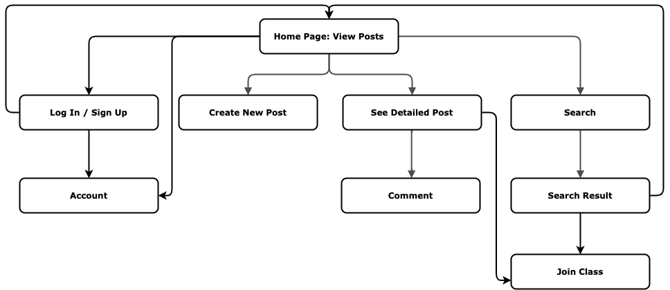
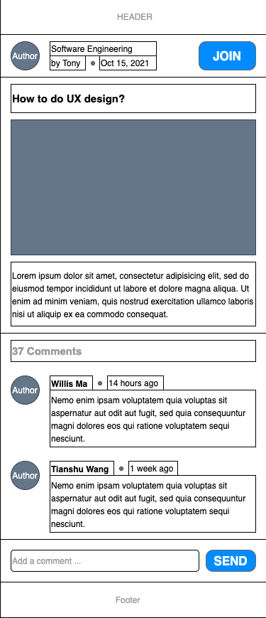

# User Experience Design

This repository contains instructions and files for two assignments that together comprise the user experience design phase of a web app.

- [User Experience Design](#user-experience-design)
  - [App Map](#app-map)
  - [Wireframes](#wireframes)
    - [Home Page](#home-page)
    - [Create new post](#create-new-post)
    - [Class page](#class-page)
    - [Detailed post page](#detailed-post-page)
    - [Account page - Azanah](#account-page---azanah)
  - [Prototype](#prototype)
  - [Working Doc](#working-doc)

## App Map
 

## Wireframes
### Home Page 

### Create new post 

### Class page 

### Detailed post page
   
This page is for users to view the full content of a post. Users can see the author and channel of the post, and can join the channel by simply click the join button.     
User can also see the comments under the post. Scrolling up the page will load more comments.       
There's a footer beneath the sreen, user can leave comment by clicking the footer. 
### Account page - Azanah

## Prototype
https://linkednyu.invisionapp.com/console/share/CZ34ZDPB58

## Working Doc
https://docs.google.com/document/d/1_VwycK_ivECoP4wp7RbuI-Fj60yseTb86G1DCfqK1WI/edit?usp=sharing

