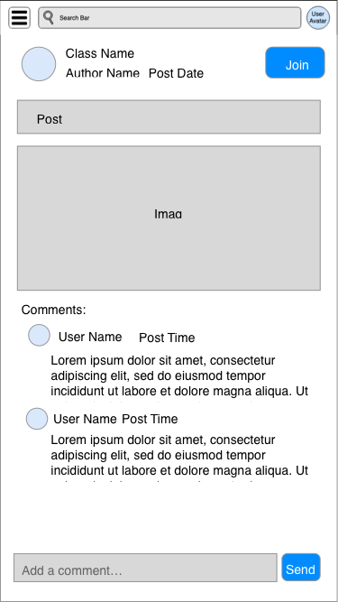
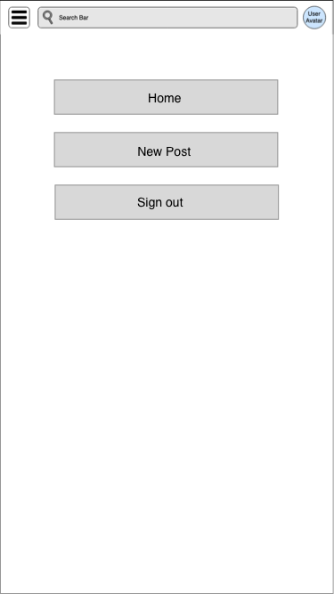

# User Experience Design

This repository contains instructions and files for two assignments that together comprise the user experience design phase of a web app.

- [User Experience Design](#user-experience-design)
  - [App Map](#app-map)
  - [Wireframes](#wireframes)
    - [Home Page](#home-page)
    - [Create new post](#create-new-post)
    - [Class page](#class-page)
    - [Detailed post page](#detailed-post-page)
    - [Account page - Azanah](#account-page---azanah)
    - [Menu](#menu)
    - [Sign In](#signin)
    - [Password Reset](#password-reset)
  - [Prototype](#prototype)
  - [Working Doc](#working-doc)

## App Map
 

## Wireframes
### Home Page 
  
The Home page is the first page the users sees upon opening the apps. This page usually contains posts tailored to the user's need. The search bar also allows the user to search on the page.
### Create new post 
  
This page allows user to post new content to any channel and indicate whether the post should be public/private. If a post is public , everyone gets access to the post whilst a specific people get access to it when is private. Therefore , its up to the user to select whether the post is private/public. This page also allows user to save a draft and post them later.
### Class page 
  
This page shows the class name , the instructor name and a link to join the class . The user is also provided a description of the class to decide whether they would like to join it or not.
### Detailed post page
   
This page is for users to view the full content of a post. Users can see the author and channel of the post, and can join the channel by simply click the join button.     
User can also see the comments under the post. Scrolling up the page will load more comments.       
There's a footer beneath the sreen, user can leave comment by clicking the footer. 
### Account page - Azanah

This page shows info/details about the user account.
### Menu
   

### signin

### password-reset
   
   

## Prototype
https://linkednyu.invisionapp.com/console/share/CZ34ZDPB58

## Working Doc
https://docs.google.com/document/d/1_VwycK_ivECoP4wp7RbuI-Fj60yseTb86G1DCfqK1WI/edit?usp=sharing

